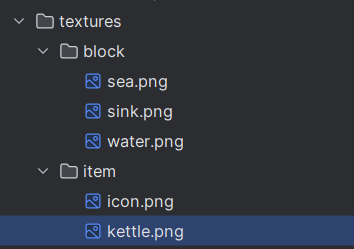
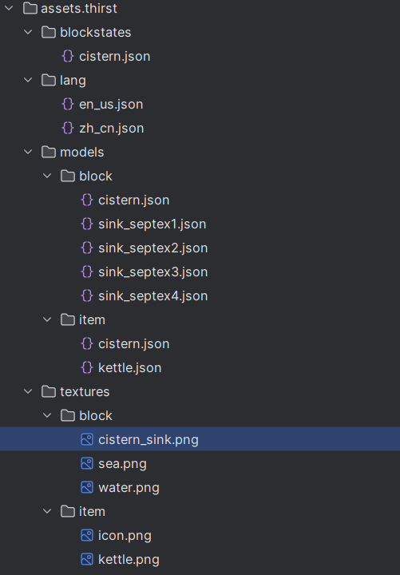
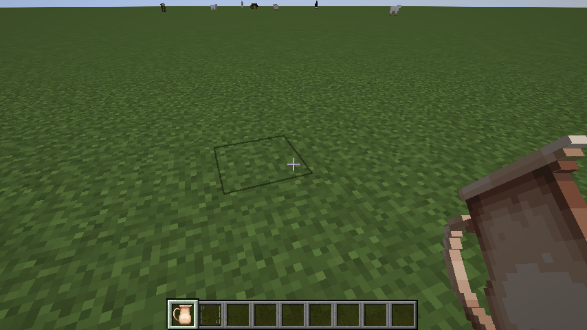

# 2.5.1.2 模型和材质

在介绍本章之前，请确保你已经了解了如下内容，若没有，请自行学习：

- 模组资源文件的位置
- 模组资源文件目录的命名规则
- json文件的格式

本节只讲解物品和方块相关的内容，其它的资源（比如GUI、音效）因为还没学过，我们暂且不讲。

## 文件的位置关系

### 物品

对于物品而言，你需要关注的只有两个目录：

- assets/<mod_id>/models/item
- assets/<mod_id>/textures/item

对于物品来讲，它长什么样子，完完全全由models目录下的对应文件规定。

注意，models文件夹下的物品文件的名字必须和物品的id一样，像我们之前提到过的水壶，它的文件名是且只能是`kettle.json`

回顾我们之前看到的[模型文件的内容](../../complete.md#模型)，注意里面有一个"textures"字段，里面规定的东西的键我们先不管它，看向它的值：

```json
"textures": {
  "0": "thirst:item/canteen",
  "particle": "thirst:item/canteen"
}
```

发现一个统一的规律了吗，规则是`<mod_id>:item/...`，观察它的键是"textures"，说明这里指向了一个材质文件，这个材质文件的位置是`assets/<mod_id>/textures/item/...`

注意，这里的`item`和`textures`是写死的，不可更改的，无论写错、多写还是少写一个字母Forge都无法识别它。

而省略号内的内容你就可以自由发挥了，你完全可以给它加长一些：

```json
thirst:item/kettle/model_textures
```

这样，它的材质文件就会去`assets/thirst/textures/item/kettle/model_textures.png`里面找了，注意，一定是`png`格式的文件。

但是这么看还是太诡异了，为什么我用了好久的kettle这个ID到最后得换成canteen（画师出来挨打）（好吧是我没跟画师沟通好）

不管怎么样，明明改成统一的形式总是有助于我们开发的，我们改一下吧。

```json
"textures": {
  "0": "thirst:item/kettle",
  "particle": "thirst:item/kettle"
}
```

然后把材质文件的文件名也改一下：



这样看起来就舒服多了。

### 方块

对于方块，你还要多关心一个blockstates文件。

我们之前已经讲过blockstates的文件位置和需要注意的项目，这里不再赘述。

在blockstates文件中，你会注意到有一个地方和我们刚刚讲的textures很像：

```json
"model": "thirst:block/sink_septex0"
```

想想，这是什么意思？

那就说明我们需要的模型文件在`assets/<mod_id>/models/block/...`下，同样的，`models`和`block`一个字母都不能错，尤其是注意`models`，在json里面我们写的不是复数。

同样的，省略号里面的内容可以乱来，当然我们希望它的命名可以统一。

那我们也给它改一下吧：

```json
"model": "thirst:block/cistern"
```

当然，模型文件里面的材质文件位置也得改

```json
"textures": {
  "0": "thirst:block/cistern_sink",
  "particle": "thirst:block/cistern_sink"
},
```



### 方块物体

和普通物体一样，方块物体的模型位置和物体一样，命名规则也一样。

方块物体可以直接套用方块的模型，具体方法稍后就讲。

不过先把它改成这样吧：

```json
{
  "parent": "thirst:block/cistern"
}
```

## 模型文件和BlockBench

模型文件真的要讲起来那恐怕得开一个新的教程了，不过好消息是，你不需要会做模型文件。坏消息是，你要看得懂模型文件。

### BlockBench

BlockBench，简称bb，也是现在在MCG中常用的一个模型制作软件。

如果说读者想要搞懂模型制作是怎么做的，可以自行下载BlockBench，动手做做看，然后观察它生成的json文件，大致也都能看懂了。

### 非BlockBench的内容

那既然模型不用我们做，我们为什么还要看得懂模型文件呢？

在1.20，自从渲染类型从代码定义改为json定义后，光一个BlockBench生成的文件不够了，有些参数需要我们自己手动添加。

另外，有些模型简单的方块你也不应该麻烦美工组做一个模型，你需要学会复用已有的模型

#### render_type

这就是我们提到的渲染类型。

渲染类型有六种，由于讲清楚具体的原理实在是过于复杂，感兴趣的话可以去了解计算机图形学相关的内容（本教程目前有在很后面制作渲染专题的计划，但是还没开始做），这里只讲五种不同的渲染类型的适用场景。

- `"render_type": "solid"`： 这是默认方块的默认渲染方式，适用于完全不透明的固体方块。有些不同类型的方块Forge会单独在代码中定义渲染类型，在后面遇到的时候我会提一下，更多的还是要靠读者实践来发现。
- `"render_type": "cutout"`：适用于完全不透明或者完全透明的方块，例如玻璃方块。
- `"render_type": "cutout_mipped`：如果听说过各向异性过滤（MipMap）这个概念的话，解释为适用于需要使用各向异性过滤的方块，如树叶。如果没有听说过，可以简单理解为在较大距离时应当缩小纹理来获得更好的视觉效果的方块，如树叶。
- `"render_type": "cutout_mipped_all`：和上面不一样的区别是，上面的表示仅对方块生效，但是这个表示对物品也需要使用各向异性过滤。使用场景和上面的一致。
- `"render_type": "translucent"`：适用于半透明方块（如染色玻璃）
- `"render_type": "tripwire"`：适用于具有渲染到天气渲染目标（即绊线）的特殊要求的块

当然，渲染类型可以通过注册的形式自选，这里套用一个Forge文档的示例：

```java
public static void onRegisterNamedRenderTypes(RegisterNamedRenderTypesEvent event)
{
  event.register("special_cutout", RenderType.cutout(), Sheets.cutoutBlockSheet());
  event.register("special_translucent", RenderType.translucent(), Sheets.translucentCullBlockSheet(), Sheets.translucentItemSheet());
}
```

这个就有兴趣自学吧，作为入门的内容来讲太难了。

当然，如果你会手搓高质量高性能渲染，欢迎来MCG的妖贤组报道。

#### parent

parent这个参数就表示你可以复用其它的模型。

诶，我们是不是好像见过[它](#方块物体)？

是的，就是在方块物体的时候。

parent字段就代表着复用它指向的模型文件，在方块物体的时候就表示该方块物体复用方块的模型。

如果说你想要再换一个材质的话，你可以再在你的模型文件中手动指定材质文件，注意，键必须和指向的模型文件中textures的键保持一致，它表示了该模型文件中材质的ID。

比如说，如果你想做一个羊毛台阶，那么你可以继承原版台阶的模型，并且复用原版台阶的模型：

Blockstates文件
```json
{
    "variants": {
        "type=bottom": [
            {
                "model": "mcgproject:block/structure/wool_slab_orange"
            }
        ],
        "type=double": [
            {
                "model": "mcgproject:block/structure/wool_slab_orange_planks"
            }
        ],
        "type=top": [
            {
                "model": "mcgproject:block/structure/wool_slab_orange_top"
            }
        ]
    }
}
```

模型文件（三个）

wool_slab_orange.json文件

```json
{
  "parent": "block/slab",
  "textures": {
    "bottom": "mcgproject:block/structure/wool_colored_orange",
    "side": "mcgproject:block/structure/wool_colored_orange",
    "top": "mcgproject:block/structure/wool_colored_orange"
  }
}
```

wool_slab_orange_planks.json文件

```json
{
    "parent": "block/cube_all",
    "textures": {
        "all": "mcgproject:block/structure/wool_colored_orange"
    }
}
```

wool_slab_orange_top.json文件
```json
{
    "parent": "block/slab_top",
    "textures": {
        "bottom": "mcgproject:block/structure/wool_colored_orange",
        "side": "mcgproject:block/structure/wool_colored_orange",
        "top": "mcgproject:block/structure/wool_colored_orange"
    }
}
```

#### item/generated

这是一个原版的模型，单独拿出来讲是因为它太特殊了。

这是一个物品的模型（切忌用于方块），它的作用就是将一个icon制作为一个稍微厚一点点的模型。

还记得材质文件夹里面有一个奇怪的`icon.png`文件吗？我们其实可以直接用它来制作成一个物品的模型。

> 至于为什么会有俩，当时没跟美工说清楚她以为是要做成一个方块。注意沟通！注意沟通！

模型文件长这样：

```json
{
	"parent": "item/generated",
	"textures": {
		"layer0": "thirst:item/icon"
	}
}
```

材质文件长这样：


那么效果就是：



具体用法可以参考下MC的原版内容。

## 后记

由于MCG确实不要求modder会制作模型（但是要会做简单模型），所以这个资源专题后面模型文件讲的有点不清不楚的。

如果你真的想要搞清楚我在说什么，还是建议去学习BlockBench的使用以及多去学学原版的用法。