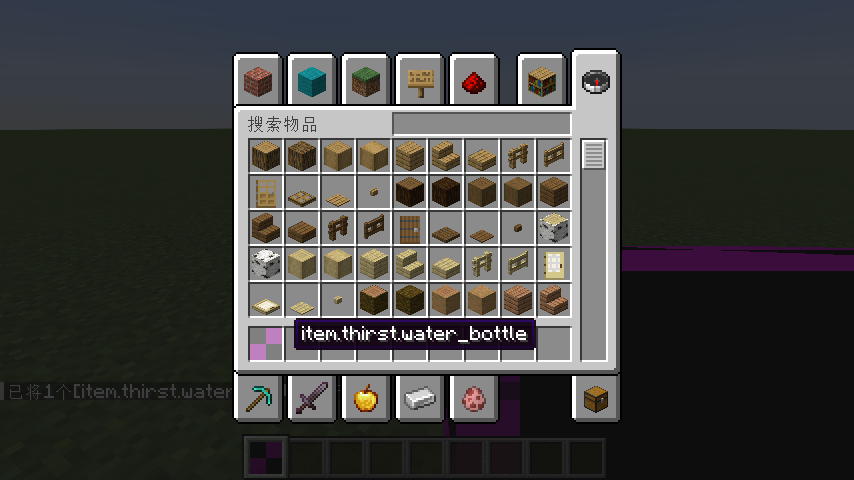

# 2.2 基础物品
## 阅前注意
从本节开始，将会涉及到一些Forge相关的概念，这些概念会和第一章一样放在最后一节进行讲解（需要讲解的概念会放在每节的最后一段）。
## 注册物品
在Forge中，我们需要将物品进行“注册”才能够在Minecraft中使用。

注册的过程相当复杂，不过幸运的是，Forge为我们提供了一个类`DeferredRegister<T>`，可以帮助我们完成注册的过程。

现在我们创建一个类，专门用于注册物品，在本教程中，这个类放在`moe.gensoukyo.thirst.register`包下，命名为`ItemRegister`。

然后我们为这个类添加一个静态成员变量，类型为`DeferredRegister<Item>`，名字为`ITEMS`。

```java
public class ItemRegister {
    public static final DeferredRegister<Item> ITEMS = DeferredRegister.create(ForgeRegistries.ITEMS, MODID);
}
```

这里的`DeferredRegister`相当于是一个容器，用于存放我们注册的物品。而`Item`是泛型，如果你不理解，可以简单理解为容器中所存放的物品的类型。

对了，关于变量名，我们提倡对于final变量使用全大写的下划线分割命名法，这样可以方便区分普通可变变量。

这个容器现在是空的，我们要做的就是向这个容器中添加我们想要注册的物品。我们先注册一个简单的，没有任何别的作用的物品：

```java
public static final RegistryObject<Item> WATER_BOTTLE = ITEMS.register("water_bottle", () -> new Item(new Item.Properties()));
```

`RegistryObject`是一个指针，指向了我们注册的物品，这个概念比较难以理解，如果你不理解，可以简单理解为`RegistryObject`就是我们注册的物品（但实际上这是错的，不过是否能够理解不重要）。

为这个变量赋值的语句比较难，但是好消息是你不需要理解它在做什么，只需要照抄就完事。

但是目前，你需要理解register的第一个参数的含义，这个参数代表了我们注册的物品的物品ID，和ModID一样，它是物品的唯一标识符。

此时这个容器还无法被Forge认可，因为我们还没有将它添加到Forge中，我们只是单纯的定义了这个容器并未使用，我们需要将我们之前的容器注册到Forge的事件总线当中。

我们需要在我们的主类中添加这样一段代码：

```java
public Thirst() {
        var bus = FMLJavaModLoadingContext.get().getModEventBus();
        ITEMS.register(bus);
}
```

这里的Thirst()代表了我们主类的构造函数，构造函数会在类被定义为对象时被调用，也就是说我们在构造函数中定义的语句会在游戏启动时被执行。

这里的`FMLJavaModLoadingContext.get().getModEventBus()`代表了Forge的事件总线，我们将我们的容器注册到这个事件总线中，这样Forge就能够识别我们的容器了。

现在，我们可以在游戏中通过give命令获得我们注册的物品了：
```
/give @s thirst:water_bottle
```


