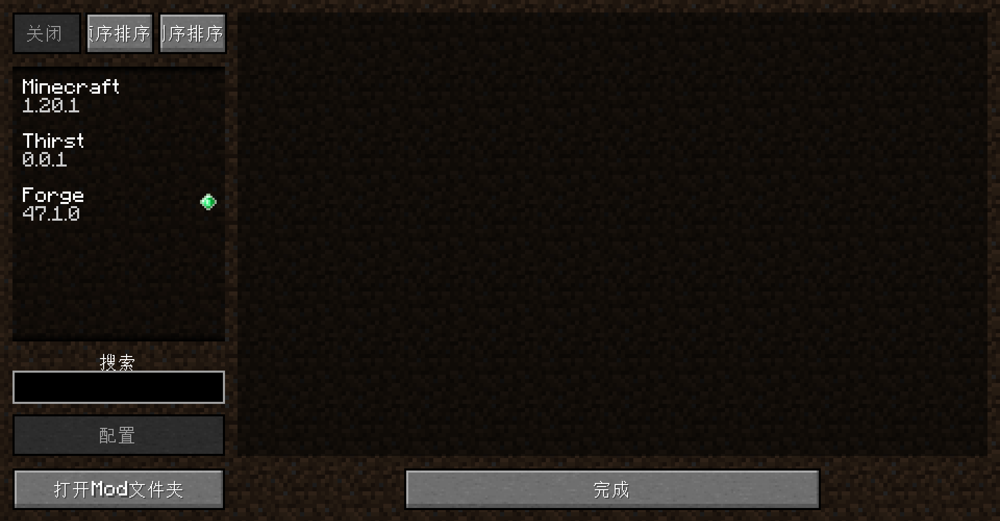

# 1.x 一些概念
## "mod_id"和"mod_name"
应该会注意到，我们用的Mod的ID和Name的值非常像，就是个大小写的问题，那为什么要写两遍内容几乎相同的东西呢？

首先要明确的一件事情是，上述二者的值其实没有任何关联，但是它们的含义几乎注定了它们的值会非常相近。

### mod_name
先说比较好理解的mod_name，顾名思义，它就是模组的名字，你会在Minecraft的模组页看到它，也就是这里：



除此之外，基本上就没啥用了。

### mod_id
mod_id是一个模组的唯一标识符，如果你的Minecraft中有两个模组的mod_id相同，那么Minecraft会认为它们是两个相同的模组而表示它们出现了冲突。

它在游戏里面的体现方式是所有与它相关的东西，在使用指令时都必须加上mod_id。

在这里我们因为还没有制作任何东西，所以我们用MCG来距离。在MCG中，有个模组的id是`mcgproject`，那么我们在使用`give`指令获取一个物品的时候就应该这样写：

```
/give kaatenn mcgproject:wool_stair_brown
```
## Warning
接下来的内容对于没有学过Java或者没有编程经验的人来说不太友好，没关系，你大可以直接跳到下一章节。后面的内容的目的只是解答一些疑惑而已，是否阅读其实并不重要。
## MCP
很奇怪的一件事情是，明明Minecraft是个商业项目，我们是怎么轻易得到它的“源代码”的？

其实Mojang从来没有给出过Minecraft的源代码，但是问题是作为一个Java项目，你永远无法阻止人去反编译你的代码。

但是反编译出来的代码我相信你是肯定看不懂的，随便举个例子（当然这个例子是我伪造的，但差不多就是这个感觉）：

```java
public class _a18111_ extends _b14110_ implements _c13851, _a39542 {
    private static final _l15531_ _L10001_ = _l15541_.__l10001__();
    // ...
}
```
你说这谁看得懂，更何况我这还能通过字母前缀看得出来至少哪些是一个大种类的，真正反编译的结果可比这诡异多了。

但是好在，有些东西你是没法藏的，比如Java中的一些原生方法。于是就有人通过这一些代码反推测原来的内容。

如今，反混淆的程度越来越高，Mojang也开始逐渐放出一些官方的反混淆方案，当然，不是很有用）

在MCG中，我们使用的是parchment的反混淆方案，在[设置](settings.md)中体现如下：
- 修改`gradle.properties`中的`mapping_channel`和`mapping_version`
- 修改`settings.gradle`的相关内容
- 修改`build.gradle`的相关内容
## MDK
似乎还有一个和`M`相关的东西，叫`MDK`，这是我们一开始下载的东西。

这也很奇怪诶：明明我们学习的是Forge开发，为什么用的工具叫MDK？

其实很简单，我们能够使用的只是Forge所给我们提供的工具，也就是`Mod Development Kit`，翻译过来就是`模组开发套件`

看到这个中文译名是不是就豁然开朗了？
## 那Forge到底是啥
从第一印象上来看，很容易将Forge定义为一种API。

但API的定义是什么呢，是一种公开的接口与方法，不负责底层实现。但是在我们的模组开发过程中我们会经常接触到Minecraft的底层，这就很奇怪了。

实际上Forge包含了两部分：`Minecraft Forge`和`Forge Mod Loader`（简称`FML`）

顾名思义，FML就是个模组加载器，可以往Minecraft中加入Mod。

而Minecraft Forge包含了两个部分：
1. 一套API以及对底层的修改方案
2. 改善Mod间兼容性的系统

所以，Forge其实是一个开发框架，用于方便Mod的开发以及不同Mod之间的兼容。
