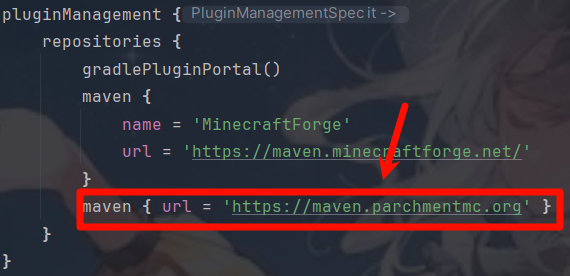

# 1.2 基础设置
由于这部分内容涉及到Modding的一些概念，可能会有些难，我会把Mod相关的部分的解释放在[这篇文章](conceptions.md)中。

但是无论如何，你是否理解这些内容并不影响你能否对这些内容成功设置，现在请打开你的项目，一项项修改下面的内容：

- 打开`gradle.properties`
    - 将`mapping_channel=official`改为`mapping_channel=parchment`
    - 将`mapping_version=1.20.1`改为`mapping_version=2023.06.26-1.20.1`
    - 将`mod_id=examplemod`改为`mod_id=[任何你希望的模组的ID]`，本教程以`mod_id=thirst`为例
      - 注意，这里你可以填入的内容只能包含数字`0~9`、小写字母`a~z`和下划线`_`
    - 将`mod_name=Example Mod`改为`mod_name=[任何你希望的模组名]`，本教程以`mod_name=Thirst`为例
      - `mod_name`的限制条件是只要是英文就行
    - 根据需要修改`mod_license`, `mod_version`, `mod_authors`和`mod_description`，在本教程中这些值如下：
      - `mod_license`的值为`GNU General Public License v3.0`
      - `mod_version`的值为`0.0.1`
      - `mod_authors`的值为`kaatenn`
      - `mod_description`的值为`A mod for writing a tutorial for Minecraft modding in Minecraft Gensoukyo.`
    - `mod_group_id`也必须需要修改，但是会在下一章节讲述
- 打开`settings.gradle`
    - 根据图示加上`maven { url = 'https://maven.parchmentmc.org' }`

- 打开`build.gradle`
    - 根据图示加上`id 'org.parchmentmc.librarian.forgegradle' version '1.+'`

然后重新加载Gradle项目，出现`BUILD SUCCESSFUL`时，除了`mod_group_id`外的所有设置就配置完毕了。