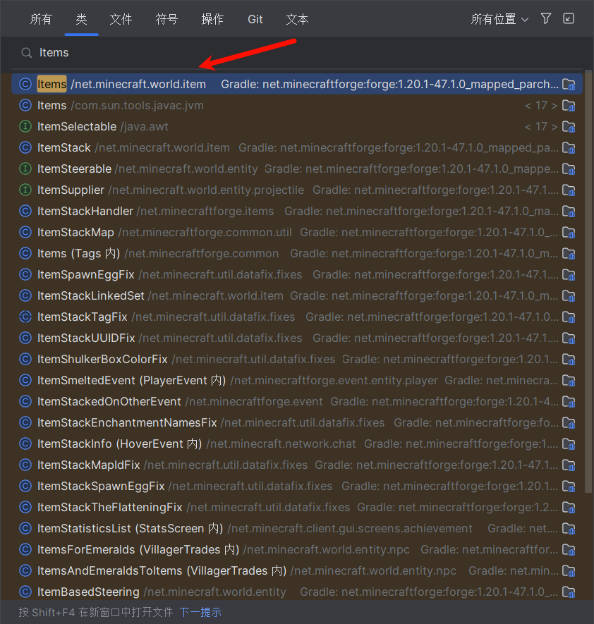
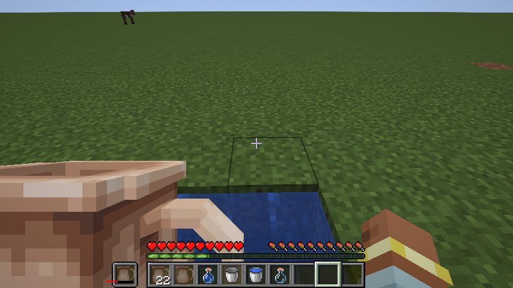

# 3.2 添加功能

## 开始添加内容吧！

多次使用对上一个物品，想想，这是什么？

不知道你想到了什么，但是我想到了耐久度。

再想想，什么有耐久？

剑、斧子、锄头……

那就去看看原版是怎么做的。在IDEA内连续点击两次shift，会打开一个搜索菜单，输入`Items`，点击类。



看到那个红色箭头标注出来的类了吗，单击它，就会把这个类的文件展现给你。

这个类是Minecraft Forge为你提供的原版的物品注册的类，你可以在里面找到所有物品的注册。

按下`Ctrl+F`，搜索一个你想要搜索的东西，比如`sword`

我们以这行为例：

```java
   public static final Item WOODEN_SWORD = registerItem("wooden_sword", new SwordItem(Tiers.WOOD, 3, -2.4F, new Item.Properties()));
```

参照下我们之前的注册，那么是不是说明剑这一Minecraft“自定义”的物品是`SwordItem`类的？

按住`Ctrl`，左键单击`SwordItem`，你就会跳转到这个类的文件当中，找找有没有耐久度的定义。

很遗憾，似乎只找到了这么一段还算有点关系的内容：

```java
   public boolean hurtEnemy(ItemStack pStack, LivingEntity pTarget, LivingEntity pAttacker) {
      pStack.hurtAndBreak(1, pAttacker, (p_43296_) -> {
         p_43296_.broadcastBreakEvent(EquipmentSlot.MAINHAND);
      });
      return true;
   }
```

但这看起来是定义损失耐久的规则啊，不像是定义物品“有耐久”这件事的。

那翻到最上面，看到这段代码：

```java
public class SwordItem extends TieredItem implements Vanishable
```

它似乎不是直接继承的`Item`类，那说明有可能在它的父类`TieredItem`或者**接口**`Vanishable`定义了这件事情。

看向`TieredItem`的构造函数：

```java
    public TieredItem(Tier pTier, Item.Properties pProperties) {
        super(pProperties.defaultDurability(pTier.getUses()));
        this.tier = pTier;
    }
```

`defaultDurability`，翻译过来就是默认存在时间，但剑哪来存在时间一说，那就猜这个奇怪的东西是耐久度。

```java
    public EmptyKettleItem(Properties pProperties) {
        super(pProperties.defaultDurability(4));
    }
```

进游戏，你会发现两个问题：

1. 没有耐久条
2. 物品不能堆叠

## 物品栏内堆叠

其实上述两个问题都指向了同一个事情：耐久度生效了，并且耐久度无法降低。

那可不是嘛，你都有耐久度了物品怎么堆叠嘛。

那这件事情无解，除非你去动内部文件。

我们想想原版有没有这样的事情。

那玻璃瓶不就是嘛，就只是玻璃瓶不能多次喝而已。

再想想，玻璃瓶咋做的？

从你手上删掉一个空的玻璃瓶，给你个水瓶。

那照做嘛，我们不是还有个ID是`kettle`的物品还没用过嘛。

我们把`EmptyKettleItem`类改回原来的样子，然后新建一个`KettleItem`类，让它的构造函数定义耐久值不久好了嘛。

```java
    public KettleItem(Properties pProperties) {
        super(pProperties.defaultDurability(4)); // 设置耐久为 4
    }
```

## 饮水动作

想想，我们现在肯定是要修改我们的`KettleItem`类（别改错了哦），我们的耐久条该怎么减少？喝一次掉一点耐久对吧。

那我们现在需要两个东西：

1. 让它能被喝
2. 让它的耐久可以掉

那首先是能被喝，那还是和之前的思路一样，想想有什么可以喝的。

那不是很明白嘛，水瓶、药瓶。

那就去看呗，我们以药瓶`potion`为例。

点进去一看，第一行，看见了个熟悉又不是很熟悉的东西：

```java
private static final int DRINK_DURATION = 32;
```

行了，这次直译过来是饮用时间了。

但是一来它只是挂在这儿，而来它又是个**私有成员**，怎么想都不应该只有这点东西。

再找找……

下来第三个函数：

```java
public ItemStack finishUsingItem(ItemStack pStack, Level pLevel, LivingEntity pEntityLiving)
```

这个有点意思，结束使用物品，看起来就像是喝完了以后的处理。

再找找……

又有一个函数：

```java
public InteractionResult useOn(UseOnContext pContext)
```

但是不对，注释里写的是"Called when this item is used when targeting a Block"，喝东西不可能是得对着方块才能喝的。

再找找……

找到了三个有用的函数（不懂的时候可以多看看注释哦）：

```java
public int getUseDuration(ItemStack pStack)
public UseAnim getUseAnimation(ItemStack pStack)
public InteractionResultHolder<ItemStack> use
```

这三个就是我们要用到的函数。

那咋办？先照抄看看嘛，哪还有别的啥好的办法嘛，你又没学过别的。

好消息，你抄下来后确实能喝了。

坏消息，你嘴太小了，连水壶里面的一滴水都喝不掉。

好吧，我开玩笑的。那确实嘛，你连掉耐久度的逻辑都没做，它凭啥自己掉耐久度嘛。

但是在做之前，我们先改一句代码：

```java
    private static final int DRINKING_DURATION = 32;
    
    @Override
    public int getUseDuration(@NotNull ItemStack pStack) {
        return DRINKING_DURATION;
    }
```

就图着看代码好看点。

## 耐久度

虽然我们也可以去找右键降低耐久度的方法（比如铲子），但是我决定这里给读者们提供另一个思路（不推荐常用）——猜。

是的，就是猜，猜原版哪个方法是做这件事的。（这个方法基本上只在你实在想不到办法的时候试）

那么首先，我们先想想哪个方法应该在我们掉耐久度的时候被调用？

就是我们之前找到的`finishUsingItem`方法嘛，用完物品的时候，那不就是喝完嘛。

先重载它再说：

```java
    @Override
    public @NotNull ItemStack finishUsingItem(@NotNull ItemStack pStack, @NotNull Level pLevel, @NotNull LivingEntity pLivingEntity) {
        return pStack;
    }
```

然后我们想想，怎么样才能减少耐久度？

那肯定是要对ItemStack作处理嘛。

那就来猜！

在函数体中输入`pStack.`，IDEA就会给你显示所有可以使用的函数。

这里我觉得如果各位真的只是纯猜的话估计要猜好久，因为英文名实在有点不符合常理，这也是为什么我不推荐经常去猜的做法。

这里要用的方法是`pStack.setDamageValue(int pDamage)`。

那就改成：

```java
    @Override
    public @NotNull ItemStack finishUsingItem(@NotNull ItemStack pStack, @NotNull Level pLevel, @NotNull LivingEntity pLivingEntity) {
        pStack.setDamageValue(pStack.getDamageValue() + 1);
        return pStack;
    }
```

恭喜你，获得了一个水量可以是负数的水壶，可喜可贺可喜可贺。



那总是做个耐久度降为零然后销毁的逻辑吧，在MC中实际上就是减少一个你物品栏中对应的物品。

```java
    @Override
    public @NotNull ItemStack finishUsingItem(@NotNull ItemStack pStack, @NotNull Level pLevel, @NotNull LivingEntity pLivingEntity) {
        pStack.setDamageValue(pStack.getDamageValue() + 1);
        if (pStack.getDamageValue() >= pStack.getMaxDamage()) {
            pStack.shrink(1);
        }
        return pStack;
    }
```

但是，你喝水带着水壶一起喝掉的啊？